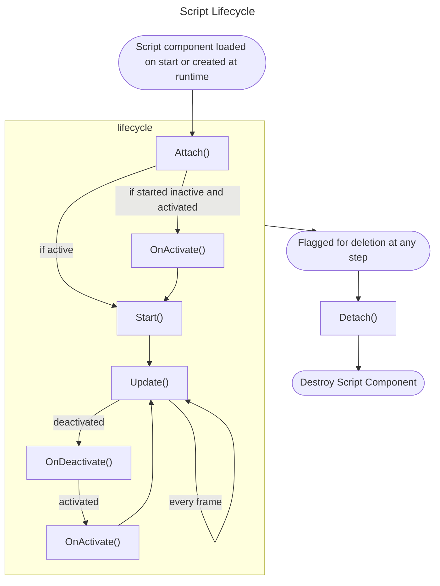

`Client`
`Server`

The lua table referred to in a script with `self`


```lua
local self = {}

--Called once on object creation before Start()
function self:Attach()
end

--Called once on object creation after Attach()
function self:Start()
end

--Called once a frame after Start() if the object is active
function self:Update(dt)
end

function self:OnActivate()
end

function self:OnDeactivate()
end

--Called when script component or object is destroyed
function self:Detach()
end

return self
```



## Methods

### nil Start() {#nil-Start}
Called once on object creation after Attach()

### nil Update(number deltaTime) {#nil-Update-number-deltaTime}
Called once a frame after Start() if the object is active 

### nil Attach() {#nil-Attach}
Called once on object creation before Start()

### nil Detach() {#nil-Detach}
Called when script component or object is destroyed

### nil OnActivate() {#nil-OnActivate}

### nil OnDeactivate() {#nil-OnDeactivate}

### nil RPC(string, ...) {#nil-RPC-string}
Call a lua function by name from server to all clients or from one client to server. You may pass parameters. 
You may send tables and basic math types such as `Vec3` or `Quat` but other classes may not be supported.

```lua
function self:Start()
    --remember to sync the script component to clients otherwise there is no one to receive the RPCs
    self.component.syncToClients = true
    self.cam = Scene:GetActiveCamera()

    events.mouseButtonDown.addListener(self, function (button, from)
        if self.onServer then return end
        --if left mouse button pressed create a ray from mouse position and direction
        if button == 1 then
            local mpos = Input:MousePosPerc()
            local tf = self.cam.object.transform
            local pos = tf.pos + tf.forward * 1.5

            --call this function on all clients with these two parameters
            self:RPC("serverRaycast", pos, tf.forward*1000)
        end
    end)

end

function self:serverRaycast(origin, ray)
    assert(self.onServer)
    local hit = Collision():Raycast(origin, ray)[1]
    if hit then
        --make a cross at hit
        deb:cross(hit.pos)
        print("hit")
    end
end
```


### nil RPC(integer, string, ...) {#nil-RPC-integer-string}
From server call a lua function by name on one specific client

## Properties

### Script component {#Script-component}
The script component, separate from the lua table

### Object object {#Object-object}
The object this script is attached to

### Transform transform {#Transform-transform}
The transform of the object this script is attached to

### boolean onServer {#boolean-onServer}
Use this to run part of the code only on server or client
```lua 
if self.onServer then
    -- do something only on server
end
```

### boolean onClient {#boolean-onClient}
Use this to run part of the code only on server or client
```lua 
if self.onClient then
    -- do something only on client
end
```

